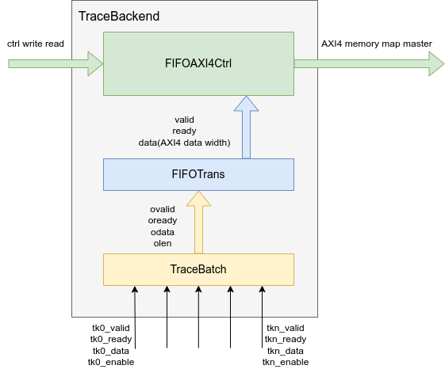
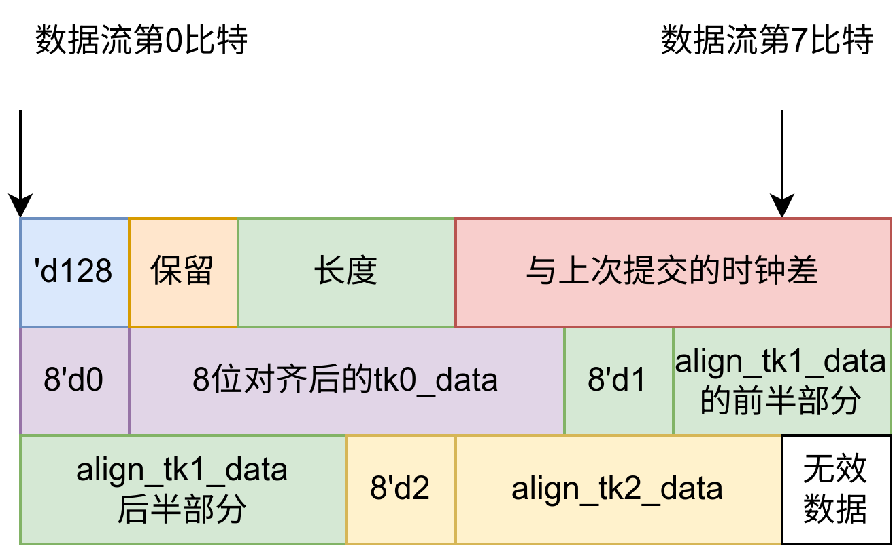

REMU's TraceBackend submodule
==============================

TraceBackend is a verilog automated generation tool to encode data to AXI4.

Architecture
-------------

How to Use
----------
Command `make backend` prints backend verilog code to stdout.
Command `make batch` only prints TraceBatch Module verilog code to stdout.
more command read Makefile.

Integration with other cmake projects
-------------------------------------
From project manage, use `add_subdirectory()` in CMakeLists.txt to add submodule.
From cpp coding, use api in `include/TraceBackend`, like `test`.

Data Flow
---------

TODO
----
- [] Test by verilator
- [] Finish FIFOAXICtrl